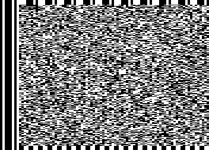
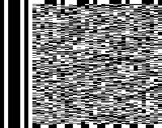
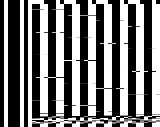
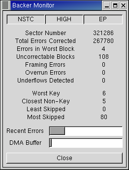

**The Backer for Linux project:  a project to develop a Linux device driver for Danmere's Backer video tape backup devices.**

**[Old SourceForge Project Page](http://sourceforge.net/projects/linbacker)**

## What is a Backer?

A company in England named [Danmere Technologies Ltd.](http://www.danmere.com) (now [4TV Ltd.](http://www.4-tv.net)) used to sell a line of devices that allow you to save data on regular video tape.  They called them Backers and they came in three flavours:  an external version that plugs into an ECP parallel port and two internal versions that sit in ISA bus slots.  If you remember the days of using audio cassettes to store programs and data then the operation of a Backer device should be familiar to you.

Unfortunately, Danmere would neither provide Linux drivers for their products nor were they willing to release programming information to developers who were willing to do so for them.  The last e-mails I sent to them on the subject were not responded to.  Finally, as of the fall of 2002, their web site has disappeared.  Oh well...

It turns out the Backer hardware is extremely simple and contains virtually no data processing intelligence whatsoever.  It plays the role of a modem, blindly modulating a byte stream into and demodulating it out of a video signal.  External software is required to perform all data framing, error correction, etc. .  The advantage of this design is that it reduces the cost of the hardware and permits a great deal of flexibility in matching the tape format to the video equipment in use.

## What is this software?

The software discussed on this page is a Linux device driver for Backers that allows you to use them as though they were standard magnetic tape devices.  With this driver, you can perform backups of your system using, for example, [GNU tar](http://www.gnu.org/software/tar/tar.html) or the archive software of your choice.

The driver version numbering works as follows.  The version major number (the number to the left of the decimal place) indicates the native tape format.  This number is increased when the driver's tape format changes in a way that makes it incompatible with previous versions.  The minor number (the number to the right of the decimal place) indicates the release number.  Minor numbers less than 100 are stable releases and will all use the same, well tested, tape format.  Minor numbers greater than or equal to 100 are unstable, developmental, releases leading up to the next major release.  Developmental releases might not be well tested and might not use the same format from release to release.

## Capabilities (stable 3.x drivers)

*   #### Data Formats
    
    The driver has two native data formats and a pass-through mode.  One of the formats is optimized for SP and LP recordings and the other for EP recordings.  The pass-through mode provides applications with access to the raw tape data stream.
    
    The data formats used by this driver are not compatible with the data formats used by Danmere's Windows software.  The driver's pass-through modes can be used to read and write non-native formats through the use of helper applications but I have not written such a utility for Danmere's format and have no plans to do so.
    
*   #### Data Transfer Rates
    
    These are calculated assuming 60 fields per second for NTSC and 50 fields per second for PAL.
    
    | SP/LP | NTSC       | PAL        |
    |-------|------------|------------|
    | Low   | 49560 B/s  | 48800 B/s  |
    | High  | 129360 B/s | 130700 B/s |
    
    | EP with bkrenhanced | NTSC       | PAL        |
    |---------------------|------------|------------|
    | Low                 | 39609 B/s  | 40752 B/s  |
    | High                | 102010 B/s | 105292 B/s |
    
*   #### Tape Capacities
    
    Multiply the numbers above by your tape length and compression ratio.  For example, for NTSC video a T-120 in SP mode at high density can hold 888 MiB uncompressed (120 minutes \* 129360 bytes/second).  Danmere's best figures are obtained assuming a high density recording (probably PAL) on a T-180 in LP mode with 2:1 compression for which they claim either a [2.8 GiB](http://www.danmere.com/backer/internaltechspec.htm) or [3.7 GiB](http://www.danmere.com/backerindex.htm) tape capacity depending on which web page you read.  Under the same conditions, this software's tape capacity would be 5.3 GiB.  Why \`\`would be''?  Because my VCR (along with every other VCR sold these days it seems) does not have an LP mode and 2:1 compression is probably a bit optimistic if your disks are full of .mp3s and other pre-compressed data.
    
    For a real-world benchmark, my system partition has 2.6 GiB of data on it (excluding /tmp, etc.) which compresses to 552 MiB using bzip2, or about 2/3 of a T-120.
    
    The highest capacity one could _hope_ to achieve is with an EP recording on a T-200 with 2:1 compression.  Such a recording can hold 6.8 GiB in NTSC format and 7.1 GiB in PAL format.
    

### System Requirements

These are the system requirements that I am aware of.  Most of them are not fundamental and could be relaxed if people with the appropriate systems could help test and debug the code.

*   **Backer hardware**
    
    Internal, ISA, version of the device.  Support for the external version is currently in development  The latest unstable release of the driver includes a module, backer\_parport, that you can go ahead and try but more than likely it will not work for you.
    
*   **Video equipment**
    
    The driver is known to work with NTSC video equipment.  I do not have access to PAL video equipment so I cannot test the software's operation in this video mode but it should work.  If it doesn't work then getting it to work is just a matter of adjusting a few numbers.  If you have PAL equipment and know that the driver works with it, please let me know so I can update this page.  If you have PAL equipment, know that the driver does not work with it and would like that to change then drop me a line.
    
*   **System architecture**
    
    Verions prior to 3.0 required i386-like system architecture:  a little endian system capable of unaligned memory reads and writes.  Since version 3.0, the software should work on any system supported by Linux.  I can only test the driver itself on an x86 system but I have compiled and run bkrencode on an IBM RS-6000 running AIX (big endian, unaligned OK) and it worked perfectly so I believe the portability issues have been addressed.
    
*   **Linux kernel**
    
    The following table indicates the kernel version I had installed on my own system while developing various versions of the driver. Thus, this table does not represent absolute requirements but rather combinations that are known to work.
    
    | Device Driver Versions | Kernel Versions |
    |------------------------|-----------------|
    | 3.102                  | 2.4.19          |
    | 3.100, 3.101           | 2.4.15, 2.4.16  |
    | 1.104 <= x < 3.100     | 2.4.3           |
    | < 1.104                | 2.0.36          |
    
*   **Minimum CPU**
    
    I do not know the minimum CPU required.  What I do know is that my PII-400 system can process tape data approximately 27 times faster than the actual tape data rate. If we assume, then, that a computer 27 times slower than a PII-400 would still (just) be able to process a data stream in real time, then a 486DX-33 is probably the bottom end of what's workable.  Unlike Danmere's software, however, this driver does not require the data to be processed in real time.  Using offline processing, I suspect that even a 386SX-16 would work just fine.

## Related Links

*   **[Linux Infrared Remote Control](http://www.lirc.org/)**
    
    A software package that, together with some hardware, allows your PC to act as an infrared remote control.  I haven't actually downloaded and checked this software out but it looks like combining it with tape operations in a script could allow you to fully automate your Backer/VCR combination allowing you to do unattended backups.

## Here's what you see on your television

### Stable 3.x Versions

These images are for NTSC video.  Most televisions can't display some number of the top and bottom lines of video so they won't actually be visible on your set.  These pictures were obtained by piping the output of bkrencode into a program I've written for analyzing tape data streams and then doing a screen capture with the [GIMP](http://www.gimp.org).

This first shot is of a data sector (one video field) and it's not too helpful unless you know what you're looking at.  The same output can be generated on your television by typing

cat /dev/zero > /dev/backer/0/nhs

The version 3.x format is not as much of an improvement over 2.x as 2.x was over 1.x but it is not without its merits.  The error control code is now used to only correct errors in actual data, it is not wasted correcting errors in unused portions of the sector.  Also, the key bytes are spread more uniformly throughout the sector.  This last improvement combined with a new, more robust, algorithm for identifying the key bytes means that it is practically impossible for noise to cause a sector to be lost --- the software can accurately identify sectors even on tapes which have been badly physically damaged.

This image is more informative.  This is a sector from the BOR mark and it allows you to make out the structure of the format.  First, the vertical lines down the left side of the image are not part of the tape data.  They are produced by the Backer hardware which prefixes each line of video with the byte 0x45.  This presumably provides the means by which the hardware's bit clock is synchronized on playback.  The top few lines contain the sector leader which is just filled with 0xe2 and is used to pad out the first few, unusable, lines of video.  Likewise the bottom few lines contain the sector trailer which also pads out unusable lines but with 0x33.  The key bytes can be seen scattered diagonally through the sector and are used to find sectors in the data stream.  The vertical bars filling the bulk of the image are the filler bytes (0x33) used in BOR and EOR sectors and would contain data if this were a normal data sector.  The parity bytes are at the bottom, filling several lines immediately above the trailer.  Finally the sector header can be made out as four bytes, here all 0, appearing just above the parity bytes towards the right side of the video frame.

Here's what a low density data sector looks like. You can get output like this by typing

cat /dev/zero > /dev/backer/0/nls

And here's a sector from the low density BOR mark.

Here's what bkrmonitor looks like
---------------------------------

### Version 3.2

This shows bkrmonitor after a 545 million byte recording that had been made in EP mode was recovered from tape.  As you can see, the raw recording could not be recovered from tape completely error-free as there were 108 uncorrectable data blocks.  However, this recording was made using the new bkrenhanced utility which had no trouble filling in the lost sectors as can be seen from it's output below

bkrenhanced: DECODING at 92.2% efficiency  
bkrenhanced: Number of lost sectors detected: 108 of 321045  
bkrenhanced: Number of errors in worst block: 3 (20 allowed)  

This shows that 108 sectors of the 321045 data sectors in the recording needed to be corrected which is a mean error rate of about 3\*10\-4.  We also see that no sector group required more than 3 of its 255 sectors to be replaced.  bkrenhanced's error control code can replace up to 20 sectors in each group so there appears to be plenty of headroom as one would expect given the mean error rate and the code rate.

* * *

**Miscellaneous**

This document uses [binary units](http://physics.nist.gov/cuu/Units/binary.html) recommended by the International Electrotechnical Commision.  So 1 MB is 106 bytes while 1 MiB is 220 bytes;  1 GB is 1012 bytes while 1 GiB is 230 bytes; etc..

* * *

**Disclaimer**

This project has been conducted entirely without the support, participation or even interest of Danmere, Ltd. (now 4-TV).  Please consider the following:

*   Direct all support requests to me.  Please do not bother Danmere/4-TV.
*   \`\`Backer'' is probably some sort of trademark or whatever or Danmere/4-TV.
*   This software is free, [Free](http://www.gnu.org/philosophy/free-sw.html) and HAS NO WARRANTY OF ANY KIND.

* * *
